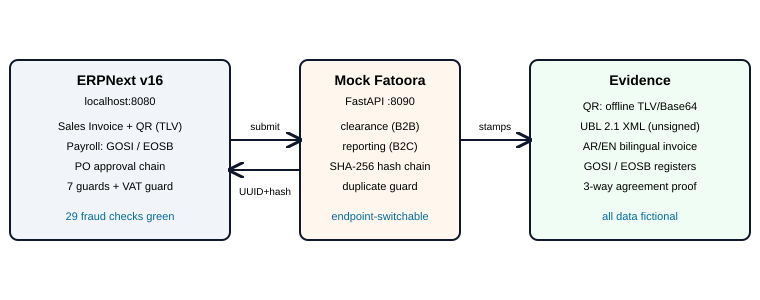

# ERPNext KSA Compliance Demo — ZATCA, Payroll & Procurement Controls


A working Saudi-compliance demo on a local ERPNext v16 stack: every invoice gets a
**ZATCA Phase 1 QR** (TLV/Base64), a **mock Fatoora** exercises the full Phase 2 clearance
lifecycle — submit → cleared → rejected → retried — with a SHA-256 chain for tamper evidence,
**payroll posts real GOSI + EOSB to the ledger** (September run, 10 employees, both
contribution halves), and **procurement enforces a 7-control approval chain** — two-level
PO approval, competitive-quote threshold, invoice-to-PO matching — stress-tested 29 ways,
all green. Arabic summary: [docs/README_AR.md](docs/README_AR.md).



> Built as a portfolio project (Sept 2026). All data is fictional (Al-Rehab Trading Est.,
> Jeddah). No real CR, no real tax authority connection — see [Honest limitations](#honest-limitations).

## Contents

- [60-second tour](#60-second-tour)
- [Quickstart](#quickstart)
- [E-invoicing (M1–M2)](#e-invoicing-m1m2)
- [Payroll (M3)](#payroll-m3)
- [Procurement controls (M4)](#procurement-controls-m4)
- [What's inside](#whats-inside)
- [Honest limitations](#honest-limitations)

## 60-second tour

| Area | What it proves | Where to look |
|---|---|---|
| Tax invoices | A QR any inspector can verify offline, plus a simulated government approval flow | [E-invoicing](#e-invoicing-m1m2), invoice `ACC-SINV-2026-00001` |
| Payroll | Correct Saudi pension splits for 10 staff, posted to the real ledger | [Payroll](#payroll-m3), GOSI register report |
| Purchasing | 7 fraud controls that survived 29 simulated attacks | [Procurement](#procurement-controls-m4), `m4_e2e_test.py` |
| Trust me, verify me | The whole demo rebuilds from zero in ~10 minutes | [Quickstart](#quickstart), `seed_demo.py` |

## Quickstart

```bash
# 1. ERPNext stack (HRMS installs automatically on first up via the init-hrms service)
#    pwd.yml itself is git-ignored (local credentials) — copy the example first.
docker desktop start
cd ZATCA-Compliance-Demo
cp pwd.yml.example pwd.yml
docker compose -f pwd.yml -p erpnext-zatca-demo up -d      # ~40s; first ever run: +10–20 min HRMS install; http://localhost:8080

# 2. Mock Fatoora (the simulated tax authority)
cd mock_fatoora && pip install -r requirements.txt && uvicorn main:app --port 8090

# 3. Standalone QR signer
cd qr-generator && pip install -r requirements.txt && python tlv_generator.py
```

Login `Administrator` / `admin`. Demo personas for the M4 chain (password `demo123`):
`buyer@…` Sami, `purchase.manager@…` Kareem, `accounts.manager@…` Amina.

**Verify everything from zero** (blank site with frappe + erpnext + hrms): copy
`erpnext_scripts/*` to `/tmp` in the backend container, then paste
`exec(open("/tmp/seed_demo.py").read())` into `bench --site <site> console` —
fixtures, all three installers, a VAT invoice, and the workflow/quote-guard proof run
themselves (6/6 checks). Then clear the printed invoice against the mock:

```bash
docker exec <backend> bench --site <site> request --args '/api/method/zatca_submit?invoice=<name>'
```

Proven 2026-09-22 on a blank `replay` site: installers create everything from zero, a fresh
invoice clears with a genesis hash chain, re-submit short-circuits, and a 36k quoteless PO
is stopped at Final Approve. The demo instance already contains the seed prerequisites
(Fiscal Year, SAR currency + Price List, selling/buying groups, UOM, Item Group, Warehouse
Type), so replay there is one step.

To replay just the fraud suite: `python erpnext_scripts/m4_e2e_test.py` (recreates its own
POs/invoices; idempotent; dates are relative to today so it never date-rots).

Caveat: the installers look up VAT accounts by name (`VAT Output`, `VAT Input`,
fallback any `%VAT%`); a fresh Saudi-CoA site needs those accounts first.
`dump_scripts.py` re-exports all 9 Server Scripts + Client Script + both reports +
both print formats from a running instance (round-trip stable).

## E-invoicing (M1–M2)

Saudi tax invoices must carry a QR code an inspector can verify offline, and (Phase 2)
be cleared through the Fatoora portal. This demo does both: it prints the QR and walks
each invoice through a simulated clearance — approved, rejected, retried.

**The compliance lifecycle, as proven in this instance:**

| State | Invoice | Evidence |
|---|---|---|
| ✅ Cleared (with VAT) | `ACC-SINV-2026-00001` — 1,288.00 SAR, VAT 168.00 | QR round-trip: PDF → extract image → decode → all 5 TLV fields match |
| ✅ Cleared via one-click button | `ACC-SINV-2026-00002` | mock ledger genesis link (`prevHash = 0000…0`) |
| 🟥 Blocked by VAT guard | `ACC-SINV-2026-00003` (cancelled) | submission refused: no `VAT 15% - ATE` template |
| 🔴 Rejected + retryable | `ACC-SINV-2026-00008` — status `Failed`, button stays visible | deterministic reject rule (invoice ends 3/8) |

**The details the QR actually guarantees:**

- **QR payload**: TLV tags 1–5 — seller name, VAT number, timestamp, total incl. VAT, VAT
  total — Base64'd, so an inspector verifies offline with no API or login. (TLV =
  tag-length-value, the QR's compact binary format.)
- **Timestamp**: local KSA time with explicit `+03:00` offset. Never `Z` on local time —
  `Z` is a UTC *claim* and would falsify the record by 3–4 hours.
- **Hash**: SHA-256 over the full submitted content (number + totals + QR); the mock chains
  each accepted invoice's hash into the next response — tampering with any earlier
  field visibly breaks the chain.
- **Phase 2 workflow split**: B2B = clearance, B2C = reporting; separate endpoints,
  one shared ledger. Duplicate submissions are rejected server-side
  (`DUPLICATE_INVOICE`), and the client short-circuits re-submit of Cleared
  invoices (`ALREADY_CLEARED`) — verified live.
- **Two signers, one payload**: `qr-generator/tlv_generator.py` (standalone, base64 lib)
  and `erpnext_scripts/zatca_submit` (in-sandbox, hand-rolled base64 — Server Scripts
  ban `import`) produce byte-identical output.
- **UBL payload** (`e-invoice/`): the XML that would actually clear Phase 2 —
  parties + VAT IDs, issue datetime, line/document VAT math — generated stdlib-only
  from the invoice JSON. `ubl_validate.py` proves ERPNext, XML and QR all agree
  (ran green on `ACC-SINV-2026-00001`: 1120.00 / 168.00 / 1288.00; a tampered
  total fails loud). Unsigned by design — see limits.
- **Bilingual invoice**: `ZATCA Bilingual Invoice` print format (Arabic RTL block,
  MSA labels, per-invoice QR from `custom_zatca_qr_image`, clearance UUID line)
  plus an Arabic Iqama alert twin. Browser print proven — see limits for PDF.

## Payroll (M3)

Salaries in Saudi Arabia split pension contributions by nationality, cap the pensionable
wage, and accrue end-of-service benefits monthly. This demo runs a real September 2026
payroll for 10 employees and posts every half to the ledger.

**September 2026 payroll, 10 employees, run and posted in the live instance:**

| Rule modeled | Proof |
|---|---|
| GOSI split by nationality: Saudi = 9.75% employee (deduction) + 11.75% employer; expat = 2% employer only | 5 Saudis show deductions, 5 expats show zero |
| Wage base = basic + housing, capped at 45,000 | Khalid: 50,000 wage base → deduction **4,387.50** = 9.75% × 45,000 |
| Mid-month joiner proration on a real KSA work-week (Sun–Thu; Fri/Sat + National Day holidays) | Fahad joined Sep 5 → 18/21 working days → gross 10,714.29 |
| Full money trail: slips → accrual JV → employer-GOSI JV → bank payment | GL: 2320 GOSI Payable 20,959.83; Payroll Payable settles to 0 via Bank Entry |
| EOSB reserve (½ month/yr ≤5 yrs, 1 month/yr after) accrued monthly, back-filled 2019→2026 | account 2330 holds 181,067.28 vs register liability 180,534.24 (see below) |
| Iqama expiry alert, 30 days ahead → HR role | Notification fired "Iqama expiring: Ahmed" into the HR Manager's bell |

Two compliance registers ship as **Query Reports** (`erpnext_scripts/*.sql`): a GOSI monthly
contribution register (portal-shaped, both contribution halves per employee) and an EOSB
liability register. The register-vs-ledger delta (~0.3%) is intentional and explainable —
the register accrues fractional months since exact joining dates; the ledger books discrete
month-end postings with the tier flipping on anniversaries. That reconciliation is exactly
the MIS finding an interviewer should ask about.

**Two customization scripts exist because the product has gaps I verified in its source:**
`employer_gosi.server.py` — HRMS v16.18.1's payroll journal aggregates only earnings +
deductions, so *employer-contribution rows never reach the GL* (found by audit; code-confirmed
in `payroll_entry.py`) — this posts them: Dr GOSI Expense / Cr GOSI Payable, idempotent per
run. `eosb_accrue.server.py` — no EOSB accrual machinery exists in core HR for KSA rules at
all; this books monthly liability per the tier above.

## Procurement controls (M4)

When a company buys things, three classic frauds are: approvals that never happened,
missing competitive quotes, and invoices for goods never ordered. This section builds one
control per fraud — seven total — then tries to break them. Three demo users act
out the scenarios: **Sami** (Purchase User — creates POs, can never approve), **Kareem**
(Purchase Manager), **Amina** (Accounts Manager).

| Control | Mechanism |
|---|---|
| Two-level approval above SAR 10,000 | Workflow `KSA PO Approval`: Request → Manager → Final Approve; ≤10k fast-tracks in one manager click (materiality tiering) |
| Competitive quote ≥ SAR 25,000 | `quote_guard` on submit: link must exist, same supplier, submitted, and **covering the PO's SAR value** — thresholds read `base_grand_total`, so a USD-priced PO can't sail under them |
| No invoice without a PO | `po_match_guard`: **every** priced line must carry a PO link (an `any()` check was launderable with one token line — audit caught it) |
| Approval chain can't be skipped | `po_submit_gate`: direct `docstatus=1` PUT lands in Approved (even escaping Rejected — audit found this); submit is now only legal when the workflow itself says Approved |
| Approval = content freeze | `pending_freeze`: buyer inflated his own PO 41.4k → 375k *while pending* (allow_edit gates the UI, not write permission — audit found this); content changes in Pending states now need a Manager role |
| Rate integrity | ERPNext core `maintain_same_rate_action=Stop` verified (PO 45 → invoice 60 blocked) — not re-invented |
| Vendor-payment fraud trail | `bank_change_audit`: any IBAN / default-bank-account retarget is stamped into the Supplier's visible timeline naming the doer, old→new |

**The stress-test story is the point.** First version passed 16/16 of my own tests; then I
attacked it with simulated fraud (the same tricks a dishonest user would try) and found
**4 real bypasses** (currency-blind thresholds, token-line laundering, docstatus escape
hatch, mid-approval TOCTOU). All four fixed, each converted into a permanent regression:
`erpnext_scripts/m4_e2e_test.py` — 29 checks, idempotent, run as the real users through
the live API. Every decision and sandbox gotcha in `DECISIONS.md`.

Residual risks, stated openly: Administrator can delete audit comments (Frappe's Version log
backstops them); the ≤10k fast-track is one click by design.

## What's inside

```
pwd.yml.example      sanitized compose stack (copy to pwd.yml; real file stays
                     git-ignored with local credentials)
qr-generator/        M1: standalone TLV→Base64→QR signer (fetches live from ERPNext API)
mock_fatoora/        M2a: Phase 2 clearance/reporting simulation (FastAPI :8090)
e-invoice/           Phase 2 payload: invoice JSON -> UBL 2.1 XML + 3-way proof
                     (ubl_generator.py, ubl_validate.py — stdlib only, unsigned)
erpnext_scripts/     live ERPNext customizations, dumped from the instance
  ZATCA (M2b–d):       zatca_submit.server.py (builds QR, calls mock, stamps invoice),
                     vat_guard.server.py (blocks VAT-less submissions),
                     zatca_button.client.js ("Submit to ZATCA" button),
                     zatca_install.py (fields + scripts + print formats + VAT template),
                     zatca_print_format.html (EN evidence) + _ar.html (AR/EN bilingual)
  Payroll (M3):        employer_gosi.server.py (the employer half HRMS omits),
                     eosb_accrue.server.py (monthly tiered accrual),
                     gosi_register.sql + eosb_register.sql (Query Reports),
                     m3_install.py (fields + scripts + notification + reports + leave types)
  Procurement (M4):    quote_guard + po_match_guard + po_submit_gate +
                     pending_freeze + bank_change_audit (.server.py),
                     m4_install.py (fields + scripts + VAT template + workflow),
                     m4_e2e_test.py (29-check fraud regression suite)
  seed_demo.py       one-command rebuild: fixtures -> installers -> VAT invoice
                     + workflow/quote-guard proof (6 checks, blank-site proven)
dump_scripts.py      re-export scripts + reports + print formats from a running instance
docs/                README_AR.md (Arabic summary), architecture.svg, MIS_NOTES.md,
                     VIDEO_SCRIPT.md + VIDEO_PLAN.md, SCREENSHOTS.md,
                     LINKEDIN_DRAFT.md, OWNERSHIP_M4.md, make_handout.py
ACC-SINV-2026-00001_ZATCA.pdf   M1 evidence: printed invoice with embedded QR
DECISIONS.md          decision journal — what was chosen and why
```

## Honest limitations

- **Fatoora is a mock** of the API contract (clearance/reporting/summary). Real Phase 2
  needs a company CR, ZATCA device certificates and CSID — impossible for an individual to
  hold, so the workflow, failure handling and hash chain are real, the counterparty is
  simulated. The client is endpoint-switchable for a real integration.
  Same boundary for `e-invoice/`: the UBL structure + math are real, the XML
  signature envelope (UUID, hash chain, ICV, signed properties) needs CSID-held keys.
- **Bilingual PDF caveat**: the AR/EN print format renders fully in the browser
  (verified HTML: Arabic + QR + UUID), but container-side PDF (WeasyPrint) shows
  tofu for Arabic — the stock image ships zero Arabic fonts. Use browser print
  for the Arabic PDF until fonts are added to the image.
- **Re-submission guard**: the mock rejects duplicates and already-Cleared invoices
  short-circuit client-side; mock downtime surfaces as `Failed` + `FATOORA_UNREACHABLE`,
  never a dead button. `acceptedAt` is a real UTC server timestamp.
- `ACC-SINV-2026-00002` cleared *before* the VAT guard existed and shows 0.00 VAT — kept
  deliberately as the "why the guard was needed" exhibit.
- Container's wkhtmltopdf can't fetch internal URLs (Docker network wall): QR is embedded
  as a **data-URI**, PDFs rendered with WeasyPrint. Documented in DECISIONS.md.
- Server Scripts require `server_script_enabled` (bench) + sandbox rules (no `import`,
  no `format()` builtins) — our signer hand-rolls Base64 to match `base64.b64encode`
  byte-for-byte, which doubles as proof we understand the encoding.
- Drafts burn invoice numbers (`00003-1` suffix once dodged a rejection rule) and submitted
  docs refuse renames — ERPNext behavior, documented in `DECISIONS.md` with workarounds.
